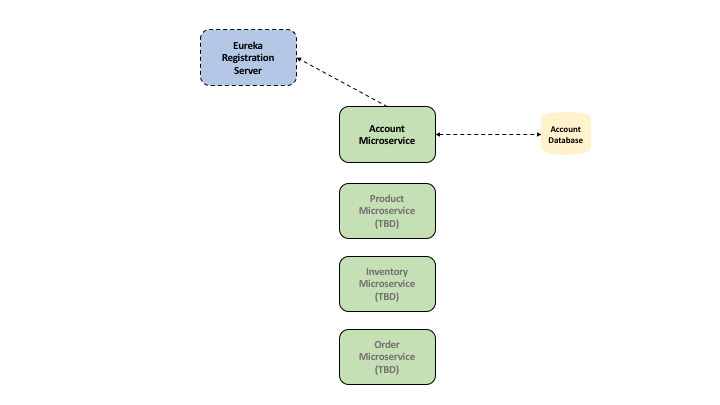

# microservices

A simple application using microservices. Over time, I hope to have the services migrated to AWS with using a mix of technologies (Java Spring, AWS Lambda, Python). Another goal is to do another webinar with the folks from Dynatrace and demonstrate how to do application performance monitoring in a microservice environment using Dynatrace's SaaS offering.

A diagram showing progress so far:

